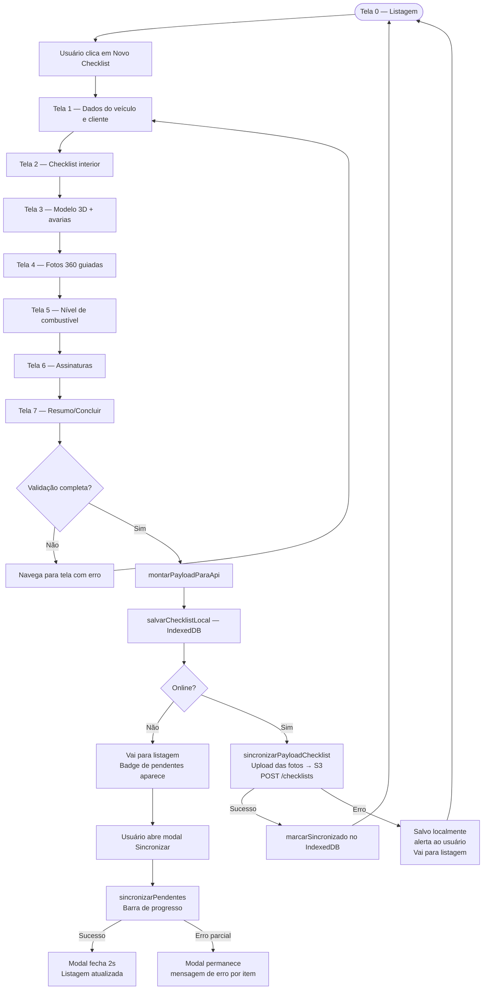
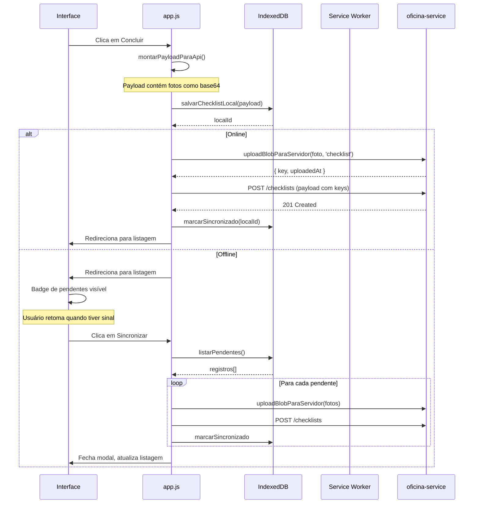

# AppChecklist — Documentação Técnica

> PWA de checklist de entrada/saída de veículos para a oficina da AC Acessórios.  
> Roda 100% offline, sincroniza automaticamente ao reconectar e pode ser instalado como app no celular/tablet.

---

## Índice

1. [Visão Geral](#1-visão-geral)
2. [Stack Tecnológica](#2-stack-tecnológica)
3. [Estrutura de Arquivos](#3-estrutura-de-arquivos)
4. [Arquitetura](#4-arquitetura)
5. [Fluxo Principal — Diagrama](#5-fluxo-principal--diagrama)
6. [Fluxo de Sincronização Offline](#6-fluxo-de-sincronização-offline)
7. [Módulos do app.js](#7-módulos-do-appjs)
8. [Configuração](#8-configuração)
9. [Deploy](#9-deploy)
10. [Integração com o Backend](#10-integração-com-o-backend)
11. [Pontos de Atenção para Novos Desenvolvedores](#11-pontos-de-atenção-para-novos-desenvolvedores)

---

## 1. Visão Geral

O AppChecklist é um **Progressive Web App (PWA)** em HTML + CSS + JavaScript puro (sem framework). Ele permite que mecânicos e recepcionistas da oficina realizem checklists completos de entrada de veículos incluindo:

- Dados do cliente, veículo e ordem de serviço
- Checklist de itens mecânicos/estéticos
- Checklist interior
- Registro de avarias sobre modelo 3D interativo do veículo
- Fotos 360 guiadas (8 ângulos obrigatórios)
- Nível de combustível
- Assinaturas digitais (cliente e responsável)
- Geração de PDF
- Entrega do veículo com registro de assinatura

Toda a operação funciona **offline-first**: dados e fotos são salvos localmente no IndexedDB e sincronizados com o backend automaticamente quando há conexão.

---

## 2. Stack Tecnológica

| Camada | Tecnologia |
|--------|------------|
| Interface | HTML5, Tailwind CSS (CDN) |
| Lógica | JavaScript ES2020+ (vanilla, sem framework) |
| 3D | `@google/model-viewer@3.3.0` (CDN cacheado pelo SW) |
| Armazenamento local | IndexedDB (via `offline-db.js`) |
| Offline / cache | Service Worker (`sw.js`) |
| PWA | `manifest.json` |
| Backend | NestJS REST API (`oficina-service`) |
| Armazenamento de imagens | AWS S3 (via backend) |
| Deploy | Docker + Nginx (arquivo estático) |

---

## 3. Estrutura de Arquivos

```
AppChecklist/
├── index.html          # Toda a estrutura de UI (telas 0–8 como seções ocultas/visíveis)
├── app.js              # Toda a lógica da aplicação (~4400 linhas)
├── app-config.js       # URLs das APIs (sobrescreve defaults via window.APP_CONFIG)
├── offline-db.js       # Camada IndexedDB — salvar/listar/sincronizar pendentes
├── sw.js               # Service Worker — cache offline de assets estáticos e modelo 3D
├── styles.css          # Estilos customizados complementares ao Tailwind
├── manifest.json       # Manifesto PWA (nome, ícones, display standalone)
├── Dockerfile          # Build multi-stage: Nginx para servir arquivos estáticos
├── models/
│   └── carro.glb       # Modelo 3D do veículo (cacheado pelo SW)
├── icons/              # Ícones PWA (192, 256, 384, 512px)
└── docs/
    └── README.md       # Este arquivo
```

---

## 4. Arquitetura

```
┌─────────────────────────────────────────────────────┐
│                    BROWSER / APP                    │
│                                                     │
│  ┌──────────┐  ┌──────────┐  ┌───────────────────┐ │
│  │index.html│  │ styles   │  │  manifest.json    │ │
│  │ (UI/UX)  │  │  .css    │  │  (PWA install)    │ │
│  └────┬─────┘  └──────────┘  └───────────────────┘ │
│       │                                             │
│  ┌────▼────────────────────────────────────────┐    │
│  │               app.js  (IIFE + globals)      │    │
│  │                                             │    │
│  │  Globals:  irParaTela, carregarChecklists,  │    │
│  │            finalizarChecklist,              │    │
│  │            sincronizarPayloadChecklist      │    │
│  │                                             │    │
│  │  IIFE iniciarApp():                         │    │
│  │    model-viewer 3D, avarias, fotos360,      │    │
│  │    assinaturas, PDF, upload, sync modal     │    │
│  │    → expõe via window.*                     │    │
│  └────┬────────────────────┬───────────────────┘    │
│       │                    │                        │
│  ┌────▼──────┐   ┌─────────▼──────────────────┐    │
│  │app-config │   │        offline-db.js        │    │
│  │  .js      │   │  IndexedDB: salvar, listar, │    │
│  │(API URLs) │   │  marcarSincronizado, etc.   │    │
│  └───────────┘   └────────────────────────────┘    │
│                                                     │
│  ┌──────────────────────────────────────────────┐   │
│  │              sw.js (Service Worker)          │   │
│  │  Cache: assets estáticos + modelo 3D         │   │
│  └──────────────────────────────────────────────┘   │
└──────────────────────┬──────────────────────────────┘
                       │  HTTP (fetch)
          ┌────────────▼────────────────┐
          │    oficina-service (NestJS) │
          │   POST /checklists          │
          │   POST /uploads/avarias     │
          │   POST /uploads/checklist   │
          │   GET  /checklists          │
          │   POST /checklists/:id/     │
          │        entregar             │
          └────────────────────────────┘
```

### Padrão de escopo — globals vs IIFE

`app.js` tem **duas zonas de escopo**:

| Zona | O que contém | Como acessar de fora |
|------|-------------|----------------------|
| Escopo global (top-level) | `irParaTela`, `carregarChecklists`, `finalizarChecklist`, `sincronizarPayloadChecklist`, helpers de upload e UI | Direto pelo nome |
| IIFE `iniciarApp()` | Tudo ligado ao modelo 3D, avarias, fotos360, assinaturas, PDF, modal de sync | Via `window.*` (exportado explicitamente no bloco de exports no final da IIFE) |

> **Regra importante**: qualquer função da zona global que precise de algo da IIFE deve chamar via `window.nomeDaFunção?.()`. Novas funções dentro da IIFE que precisem ser acessíveis externamente devem ser adicionadas ao bloco de exports no final da IIFE.

---

## 5. Fluxo Principal — Diagrama



---

## 6. Fluxo de Sincronização Offline



---

## 7. Módulos do app.js

O arquivo `app.js` (~4400 linhas) está organizado em seções marcadas por comentários `/* ===== ... ===== */`.

### Seções globais (fora da IIFE)

| Seção | Linhas aprox. | Responsabilidade |
|-------|--------------|-----------------|
| Config & helpers DOM | 1–30 | `$()`, `$$()`, URLs, constantes |
| Helpers de data/hora | 30–100 | Fuso horário Cuiabá, formatações |
| Helpers de imagem | 100–230 | `dataURLtoBlob`, `compressDataUrl`, `approxByteLength` |
| Upload batch | 230–480 | Classe `UploadBatch` para upload paralelo/sequencial |
| UI — progresso de upload | 480–600 | `mostrarProgressoUpload`, `ocultarProgressoUpload` |
| Upload & sync do payload | 600–715 | `contarUploadsDoPayload`, `sincronizarPayloadChecklist`, `finalizarChecklist` |
| Validações por etapa | 715–900 | `validarEtapaDados`, `validarEtapaInterior`, `validarChecklistCompleto` |
| Wizard de telas | 900–1000 | `irParaTela`, `atualizarWizardUI`, `ocultarErroValidacaoWizard` |
| Entrega do veículo | 1000–1560 | `concluirEntregaVeiculo`, listagem de checklists com entrega pendente |
| Listagem de checklists | 1560–1740 | `carregarChecklists`, `paginaAtual`, busca por placa |

### IIFE `iniciarApp()` (linha ~1735 ao final)

| Seção | Responsabilidade |
|-------|-----------------|
| Cache de elementos DOM | Variáveis `const` de todos os elementos HTML usados |
| Estado e Lock de tela | `travarTela`, `destravarTela`, `lockTelaContador` |
| Fotos 360 guiadas | Captura, preview, validação e renderização das 8 fotos obrigatórias |
| Modelo 3D + Avarias | `model-viewer`, hotspots, lista de avarias, modal de avaria, upload de foto de avaria |
| Checklist facial 3D | Faces do modelo (lateral, frente, traseira) com status visual |
| Combustível | Slider de nível de combustível |
| Assinaturas | Canvas de assinatura cliente e responsável |
| Resumo | Geração de resumo antes do envio |
| PDF | `gerarPdfComDados` via jsPDF + autoTable |
| POST para API | Listener do botão Concluir, validação, chamada de `finalizarChecklist` |
| Sync offline | `sincronizarPendentes`, `renderizarModalSync`, `abrirModalSync` |
| Exports `window.*` | Bloco final que expõe funções ao escopo global |

### Exports da IIFE (bloco final)

```js
window.resetChecklistUI         // Limpa formulário e estado
window.abrirModalSync           // Abre modal de sync
window.sincronizarPendentes     // Executa sync de pendentes
window.atualizarContadorPendentes
window.travarTela               // Exibe overlay de loading
window.destravarTela            // Oculta overlay de loading
window.montarPayloadParaApi     // Coleta dados do form → payload JSON
window.uploadBlobParaServidor   // Upload de um blob para S3 via backend
window.postJson                 // POST com timeout e mensagens de erro claras
window.getFotos360Payload       // Retorna array das fotos 360 para o payload
window.resetFotos360State       // Limpa estado das fotos 360
window.clearSignature           // Limpa canvas de assinatura
window.validarChecklistCompleto // Valida todas as etapas, retorna { valido, erros }
window.validarEtapaDados        // Valida tela 1
window.validarEtapaInterior     // Valida tela 2
```

---

## 8. Configuração

### app-config.js

```js
window.APP_CONFIG = {
  // Backend principal (checklist, avarias, uploads)
  API_BASE: 'http://oficina-service.acacessorios.local/oficina',

  // Backend de listagem (intranet)
  INTRANET_API_BASE: 'http://intranetbackend.acacessorios.local/oficina',
};
```

Edite **apenas este arquivo** para apontar para outro ambiente. O `app.js` usa `window.APP_CONFIG` com fallback para os valores default.

### Variáveis derivadas (app.js, geradas automaticamente)

| Variável | Valor |
|----------|-------|
| `API_URL` | `{API_BASE}/checklists` |
| `UPLOADS_BASE_URL` | `{API_BASE}/uploads` |
| `IMG_API_URL` | `{API_BASE}/img` |
| `ORDEM_SERVICO_BASE_URL` | `{API_BASE}/ordens-servico` |

---

## 9. Deploy

### Docker (produção)

```bash
# Build da imagem
docker build -t appchecklist .

# Rodar local
docker run -p 8080:80 appchecklist
```

O `Dockerfile` serve os arquivos estáticos via **Nginx**. Não há processo Node em produção.

### EasyPanel / Nixpacks

O projeto pode ser servido como site estático. Aponte o domínio para a porta 80 do container.

### Atualização do Service Worker

O SW usa `CACHE_VERSION = "model-viewer-cache-v2"`. Para forçar atualização do cache em produção, incremente essa constante em `sw.js`.

---

## 10. Integração com o Backend

Ver documentação completa em [`oficina-service/docs/README.md`](../../oficina-service/docs/README.md).

### Endpoints usados pelo AppChecklist

| Ação | Método | Endpoint |
|------|--------|----------|
| Criar checklist | POST | `/checklists` |
| Listar checklists | GET | `/checklists?page=N&placa=X` |
| Upload foto avaria | POST | `/uploads/avarias` (multipart) |
| Upload foto 360 | POST | `/uploads/checklist` (multipart) |
| Adicionar foto ao checklist | POST | `/checklists/:id/fotos` |
| Buscar entrega pendente | GET | `/checklists/:id/entrega` |
| Registrar entrega | POST | `/checklists/:id/entregar` |
| Buscar imagens | GET | `/img/:checklistId` |

### Fluxo de upload de fotos (offline-first)

1. Foto capturada → armazenada como `data:image/jpeg;base64,...` no payload local
2. Ao sincronizar: `uploadBlobParaServidor(blob, tipo)` → retorna `{ key, uploadedAt }`
3. O `key` substitui o base64 no payload antes do POST `/checklists`
4. O backend armazena no S3 e indexa o `key` no banco

---

## 11. Pontos de Atenção para Novos Desenvolvedores

### ⚠️ Regra de escopo (crítica)

Funções dentro da IIFE `iniciarApp()` **não são acessíveis globalmente** por padrão. Se você criar uma nova função dentro da IIFE e precisar chamá-la de fora (inclusive de outras funções globais), adicione ao bloco de exports:

```js
// Final da IIFE, antes de })()
window.suaNovaFuncao = suaNovaFuncao;
```

E nas funções globais que a chamam, use sempre:

```js
window.suaNovaFuncao?.();
```

### ⚠️ statusPost

A variável `statusPost` é local da IIFE. Funções globais que precisam atualizar o status devem resolver via DOM:

```js
const statusPost = document.getElementById('post-status');
```

### 📋 Adicionar nova tela (etapa) ao wizard

1. Adicionar a seção `<section id="tela-N">` no `index.html`
2. Adicionar o passo no wizard (barra de progresso) no HTML
3. Ajustar a lógica de `irParaTela(n)` e `atualizarWizardUI()` em `app.js`
4. Adicionar validação em `validarChecklistCompleto()` se necessário
5. Incluir os dados da tela em `montarPayloadParaApi()`

### 📋 Adicionar novo campo ao payload

1. Capturar o valor no HTML com um `id` único
2. Incluir em `montarPayloadParaApi()` (dentro da IIFE)
3. Adicionar ao DTO correspondente no `oficina-service`
4. Atualizar `resetChecklistUI()` para limpar o campo

### 🔄 IndexedDB — estrutura do registro

```js
{
  localId: "uuid-gerado-localmente",
  status: "pendente" | "sincronizado" | "erro",
  payload: { /* payload completo com base64 das fotos */ },
  criadoEm: 1715000000000  // timestamp ms
}
```
